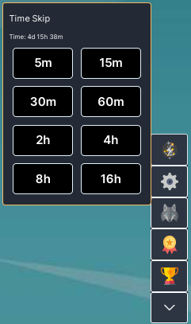

# Offline Time Bank
### By: Roaan and Tetricidal

  Offline Time Bank changes the way offline time functions. Instead of receiving away gains when you log in, the away gains are removed and all the time you would have gained is instead stored in a time bank that you can use whenever you want. Using banked time allows you to "time skip" into the future and get away gains just like you originally would have in the base game. This system is nearly identical to how the "ticks" system in township works with only minor differences. **If you hate the ticks system from township then this mod is not for you, and that's okay**.

# Features

## Time Skipping

  The core feature of this mod allows you to make time jumps in increments of your choosing instead of granting progress while you are away. Time can be spent in 8 preset intervals so you can preform activities in small increments while switching tasks often (30 min of potions, 15 min of ammo crafting, then 2hrs of summoning tablets) or you can use large chunks similar to how you might have without mods (4rhs fishing then 8hrs of cooking). Now you can micromanage your time spent without having to log in several times a day every single day.

## Minibar Quick Access

  Offline Time Bank also has an entry in the skilling minibar that allows you the same skip time functions, but closer to where you were tweaking your setup already. (Can be toggled in the configs)

## Configurable

### **Mini-Bar**

  If you do not use the minibar or think it takes up too much space, you can turn it off or on at will
[Default = True]

### **Offline Time Multiplier**

  All offline time banked will first be multiplied by this number. Since spending time increments for only exactly as much time is needed for any given task is nearly perfectly optimal, it may be fair to accrue offline time at a reduced rate since that time is more valuable and better spent in increments.
[Default = 0.8]

### **Maximum Offline Time**

  How much offline time can accrue while away. The above "Offline Time Multiplier" applies after your time maximum is calculated. The base game has a 24hr limit and with defualt multiplier those 24hrs would become `24hrs x 0.87 = 19h 12m`. For unlimited offline time set to -1.
[Default = 24]

### **Offline Time Ratio**

  Allows you to split your offline time between banking with the mod and using normal base game behavior. The value indicates what % of your offline time will be banked for later. The rest of the time is awarded just like the base game as well as not being subject to the Offline Time Multiplier setting.
  
  **Example:** If you use base configs with but with Offline Time Ratio at 60%, then 60% of your away time will be banked with the time multiplier applied. 24hrs away = 9h 36m (24h x 40%) normal afk reward and 14h 31m (24 x 60% x 0.8) time banked. **Warning:** offline time that is not banked is will still be subject to the 24hrs offline maximum from the base game. Even if "Maximum Offline Time" is set to -1 (infinite).
[Default = 100%]

## Error Messages

  Offline Time Bank has several checks to ensure no offline time gets wasted. All error reports are displayed via messages that appear at the bottom of the screen (exactly like getting stunned in thieving). If you experience some odd behavior, check the bottom of the screen.

# Inspiration & Motivation

  I was inspired to make this mod by one of my favorite idle games ever "[Idle Loops](https://omsi6.github.io/loops/)" by [Stopsign](https://stopsign.github.io/). In Loops you do not gain anything while away but instead you bank "Bonus Seconds" and at your discretion you can spend bonus seconds to accelerate time. I also loved using Time Candies from "[Legends of Idleon](https://www.legendsofidleon.com/)" to do small tasks in 1-2hr time skips without having to set a timer to come back several times a day.
  
  At my core I am rampant min-maxer and if I am not doing things "optimally" a lot of times I stop having fun. Once I maxed in base Melvor just as the expansion launched, I found myself wanting to do various tasks for small periods of time (summoning for only 1 hour) but I wanted to be able to step away from the game for 12hrs+ without feeling like I'm missing out by not switching tasks frequently. Thus this mod idea was born. I dreamed about spending all that time I was away however I chose and I wanted to be able to split up that time among multiple tasks. Since we can't queue actions to optimize away time like some games, I chose to go this route and add the feature myself. Once the new skill Township came out and the ticks system was added for it, I knew that was what I wanted for the main game this whole time and thus the mod began.

### Credits

  A huge part of getting this mod started came from Tetricidal (` [ Tetris ]#1344 `) and his mod "[Time Skip](https://mod.io/g/melvoridle/m/time-skip)". Offline Time Bank was developed with his blessing and assistance and will take over as Time Skip's successor. Big shoutout to Tet for the jumpstart to get motivated and expand Time Skip into Offline Time Bank. If you have any questions or concerns tag Tet or me (` Roaan#7005 `) in a comment on the [official discord](https://discord.com/invite/melvoridle)#mod-discussions, or drop me a DM. Have fun!

### GUI Help Wanted

Know HTML? CSS? Can you make stuff look pretty? Message me! I am not a UI Guy and any help would be greatly appreciated.

### Config Preset Ideas
Name|Multiplier|Away|Bank|Desc
---|---|---|---|---
Default|0.8|24hr|100%|The way Malcs intended
Dev Mode|0.8|-1|100%|Personally, I'll be playing this way 
Set It and Forget It|1.0|-1|100%|100% efficient, infinite away time
Vanilla+|1.0|24hr|25%|I want to play mostly normally and bank a little time on the side
Long Grind Mode|0.8|-1|0%|I am training an infinite skill (Agi/Ast/etc) and want avoid the tax while I train

### P.S.

If I get **any** non-constructive or hateful comments that use the word "township" I *will* laugh at you.
